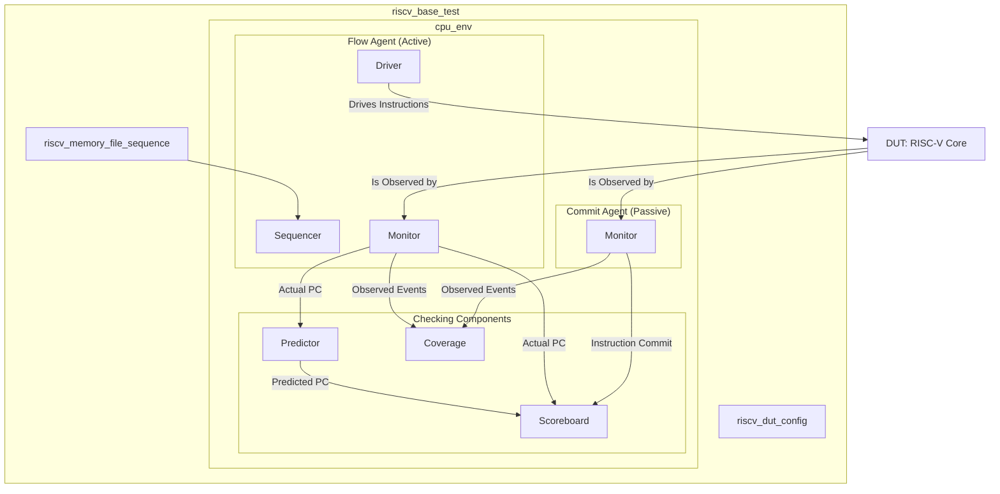

# RISC-V Processor and UVM Verification Environment

This document describes the **classic UVM approach** used for the RISC-V processor verification.

## UVM Classic Implementation

The `uvm_classic/` directory contains a complete, **active UVM testbench**. This environment has evolved from its original passive implementation into a more robust, stimulus-driven verification framework.

### Overview

This implementation uses an **active, dual-path UVM methodology**:

1.  **Flow Path (Active Stimulus & PC Checking)**: An active agent drives compiled `riscv-dv` test programs to the DUT. In parallel, it uses a predictor and scoreboard to perform cycle-by-cycle checking of the program counter (PC) flow.
2.  **Commit Path (Passive Golden Model Checking)**: A passive agent monitors the DUT's commit stage, comparing every retired instruction against a golden trace file generated by the Spike ISA simulator.

### Architecture

The environment separates the concerns of stimulus generation and end-to-end checking, following a standard hierarchical UVM structure.



### Key Features

- **Active Stimulus Generation**: The UVM testbench directly drives instructions from a compiled test program, replacing the hardware instruction memory.
- **Dual-Path Verification**: Combines low-level, cycle-accurate PC flow checking with high-level, end-to-end commit validation against a golden model.
- **Spike-Based Golden Reference**: Uses traces from the Spike simulator for robust, bit-accurate, end-to-end checking in the `commit_scoreboard`.
- **Hardware Data Memory**: The original `data_memory.v` module remains in the testbench to verify load/store instruction functionality.
- **Known Limitation**: The `flow_predictor` is a work-in-progress and currently only predicts sequential (PC+4) program flow. It will report false errors on branches and jumps. The commit path provides the primary verification.

## Quick Start

### 1. UVM Smoke Test (No external test program)
```bash
make uvm_smoke
```

### 2. UVM Regression with Generated Test Program
```bash
make uvm_regress
```

This command will:
- Generate a random test program
- Compile it to memory format
- Run Spike reference simulation
- Run UVM testbench and compare results

### 3. Using Specific Seed (Recommended for Testing)
```bash
mkdir -p logs
echo "846056" > logs/seeds.txt
PRESERVE_SEEDS=1 make uvm_regress
```

## Project Structure

The `uvm_classic` directory is organized by UVM component type:

```
uvm_classic/
├── uvm_top.sv               # Top-level testbench, connects DUT and UVM test
├── cpu_top.sv               # DUT wrapper, instantiates the processor
├── cpu_interface.sv         # SystemVerilog interface for DUT connections
├── riscv_uvm_pkg.sv         # UVM package, imports all class files
│
├── agents/                  # UVM agents (containers for drivers, sequencers, monitors)
│   ├── cpu_flow_agent.sv    # ACTIVE agent for driving stimulus
│   └── cpu_commit_agent.sv  # PASSIVE agent for monitoring commit
│
├── config/                  # Configuration objects
│   └── riscv_dut_config.sv  # Holds test-specific configuration data
│
├── drivers/                 # Drives signals to the DUT
│   └── cpu_instruction_driver.sv # Drives instructions from the sequence to the DUT
│
├── env/                     # UVM environment
│   └── cpu_env.sv           # Instantiates and connects all agents and scoreboards
│
├── monitors/                # Passively observe DUT signals
│   ├── cpu_flow_monitor.sv  # Monitors PC and instruction fetch
│   └── cpu_commit_monitor.sv # Monitors final instruction commit/write-back
│
├── predictors/              # Predicts DUT behavior for online checking
│   └── cpu_flow_predictor.sv # Predicts next_PC based on current instruction
│
├── sequences/               # Generate stimulus
│   └── riscv_instruction_sequences.sv # Sequence to read and drive a test from a file
│
├── sequencers/              # Arbitrate between sequences
│   └── cpu_instruction_sequencer.sv # Manages transaction flow to the driver
│
├── subscribers/             # Components that receive data (scoreboards, etc.)
│   ├── cpu_flow_scoreboard.sv  # Compares actual PC flow vs. predicted flow
│   └── cpu_commit_scoreboard.sv # Compares actual commit vs. Spike golden log
│
├── tests/                   # UVM tests
│   └── riscv_base_test.sv   # Base test, configures environment and starts sequence
│
└── transactions/            # Data objects for communication
    ├── riscv_instruction_transaction.sv # For instructions from sequencer to driver
    ├── riscv_flow_transaction.sv        # For PC data from flow_monitor to flow_scoreboard
    └── riscv_commit_transaction.sv      # For commit data from commit_monitor to commit_scoreboard
```

### Traditional Script-Based Approach
- `uvm_scripted_flow/tb_top.sv` - Original working script-based testbench
- `uvm_scripted_flow/cpu_top.sv` - Original DUT wrapper

## Environment Requirements

Ensure these environment variables are set (in `.env` file):
- `QUESTA_HOME` - Path to Questa installation
- `UVM_HOME` - Path to UVM library  
- `HOST_CC_PATH` - Path to C++ compiler

## Expected Output

Successful UVM run should show:
- PC MATCH messages for each instruction
- ECALL detection and graceful termination  
- UVM_INFO messages with zero UVM_ERRORs
- Clean test completion

## Design Philosophy

This UVM implementation has evolved into an **active verification environment** that provides robust, multi-faceted checking.

- **Controlled Stimulus**: Using a UVM driver to inject instructions provides greater control and observability than a hardware memory module.
- **Layered Checking**: The flow path provides immediate, cycle-by-cycle feedback on control flow, while the commit path provides definitive, end-to-end validation of architectural correctness.
- **Focused Verification**: By leveraging the Spike golden model, the `commit_scoreboard` can focus solely on instruction execution correctness without needing to replicate complex prediction logic.
