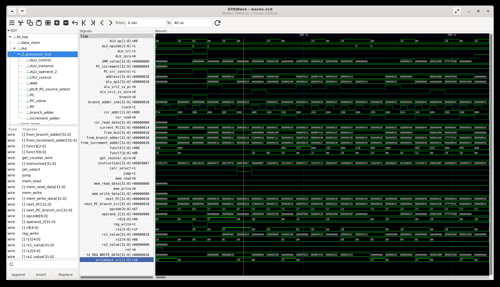

# RISC-V Processor and UVM Verification Environment

This repository contains the implementation of a 32-bit RISC-V processor and a comprehensive UVM-based verification environment designed to ensure its correctness.

## Core Architecture

The processor is a single-cycle implementation of the **RV32I base integer instruction set**. It is composed of the following key modules located in the `rtl/` directory:

- **`processor.v`**: The top-level module that integrates all components.
- **`CPU_controller.v`**: Decodes instructions and generates control signals.
- **`ALU.v`**: Performs arithmetic and logical operations.
- **`ALU_controller.v`**: Generates the specific opcode for the ALU.
- **`imm_gen.v`**: Extracts and sign-extends immediate values from instructions.
- **`register_file.v`**: Manages the 32 general-purpose registers and basic CSRs.
- **`program_counter.v`**: Manages the program counter.
- **`instruction_memory.v` / `data_memory.v`**: Models the memory system.

## Project Structure

The repository is organized to support a complete verification workflow, from simulation and coverage analysis to formal verification and bug tracking, as outlined below:

```
riscv-core-dv-uvm/
├── rtl/              # All processor RTL files (processor.v, ALU.v, etc.)
├── uvm_env/          # UVM verification environment (tb_top.sv, sequences)
├── coverage/         # Coverage reports (merged.ucdb, HTML reports)
├── formal_proof/     # Formal property verification files
├── bug_story/        # Bug report and analysis
├── scripts/          # Helper scripts for automation (e.g., seed generation)
├── docs/             # Verification plan and other documentation
├── Makefile          # Automates compiling, simulation, and other tasks
└── README.md         # This file
```

## Getting Started

### Prerequisites

Before running any simulations, you must install the necessary tools and set up the environment.

1.  **QuestaSim**: This project requires a SystemVerilog simulator that supports UVM, such as **Siemens QuestaSim**. Ensure that the `QUESTA_HOME` environment variable in your `.env` file points to your installation directory.

2.  **RISC-V GCC Toolchain**: The toolchain is required to compile the generated assembly tests into ELF files. This project is configured for the `riscv64-unknown-elf` toolchain.
    *   **Installation**: You can build the toolchain from the [riscv-gnu-toolchain](https://github.com/riscv-collab/riscv-gnu-toolchain) repository. Follow their instructions for building and installation.
    *   **Configuration**: Ensure the compiled binaries (e.g., `riscv64-unknown-elf-gcc`) are available in your system's `PATH`.

3.  **Spike (RISC-V ISA Simulator)**: Spike is used as the golden reference model to generate a trusted instruction trace.
    *   **Installation**: Spike can be built from the [riscv-isa-sim](https://github.com/riscv-software-src/riscv-isa-sim) repository.
    *   **Configuration**: Ensure the `spike` executable is available in your system's `PATH`.

4.  **Python 3**: The automation flow relies on several Python scripts.
    *   **Installation**: Most systems have Python 3 pre-installed. You can check with `python3 --version`.
    *   **Dependencies**: If a `requirements.txt` file is present, install the required packages using:
        ```bash
        pip install -r requirements.txt
        ```

### Environment Setup

1.  **Clone the repository and initialize submodules:**
    ```bash
    git clone git@github.com:isbogdanov/riscv-core-dv-uvm.git
    cd riscv-core-dv-uvm
    git submodule update --init --recursive
    ```

2.  **Create and activate the conda environment:**
    ```bash
    conda install -n base mamba
    mamba env create -f environment.yml
    conda activate riscv-core-dv-uvm
    ```

3.  **Create your environment file:** Copy the example file to `.env`. The Makefile will automatically load it. Edit `.env` to match your local paths if they differ from the defaults.
    ```bash
    cp env.example .env
    ```

### Running the Regression

To execute a clean regression run, use the default target:
```bash
make regress
```
This command cleans the workspace, generates a new test with a random seed, compiles it, runs both Spike and the RTL simulation, and compares the results. By default, it runs with `NUM_SEEDS=1`.

### Debugging a Specific Seed

To run a regression without cleaning the output directory or regenerating the test seed (which is useful for debugging a specific failing seed), set the `PRESERVE_SEEDS` variable:
```bash
make PRESERVE_SEEDS=1 regress
```

## Toolchain and Workflow

This project leverages a suite of standard EDA tools and an automated flow to perform robust verification. The entire process is automated with `make regress` and follows these steps:

1.  **Test Generation**: A random seed is used to invoke the `riscv-dv` generator, creating a unique assembly test file.
2.  **Compilation**: The assembly test is compiled into an ELF file using the RISC-V GCC toolchain.
3.  **Golden Trace Generation**: The ELF file is executed on the `Spike` simulator, producing a golden trace log of every instruction executed and the resulting register state changes.
4.  **RTL Simulation**:
    *   The ELF file is converted into a Verilog-compatible memory file (`.mem`) and loaded into the processor's instruction memory.
    *   `QuestaSim` runs the simulation, executing the test on the RTL implementation of the processor.
    *   During the simulation, a trace log is generated in the same format as the Spike log.
5.  **Comparison**: Both the Spike log and the RTL log are converted to a standard CSV format. A comparison script then diffs these files to ensure that the processor's behavior is bit-for-bit identical to the golden reference model.
6.  **Result**: The regression passes if the traces match perfectly, indicating that the processor correctly executed the test program.

## Waveform Example

An example waveform capture from a simulation run is shown below. A VCD file (`waves.vcd`) is automatically generated during simulation, which can be opened in a waveform viewer like GTKWave to view signals and debug the design.

 