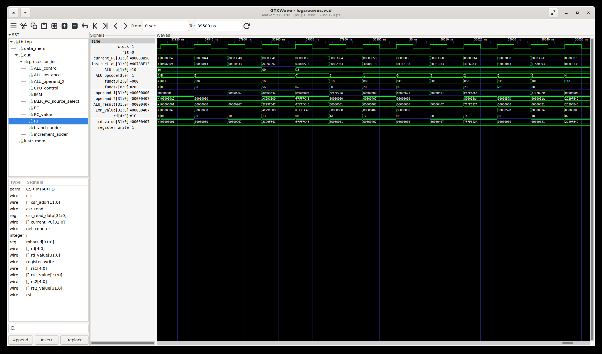

# RISC-V ALU Controller Instruction Decoding Bug

**Bug ID**: RISCV-ALU-001  
**Date Discovered**: June 18, 2025  
**Severity**: High  
**Status**: Fixed  

---

## Executive Summary

A critical bug was discovered in the ALU controller module (`rtl/ALU_controller.v`) where I-type instructions with large immediate values were incorrectly decoded as subtraction operations instead of addition. This affected ADDI instructions with immediates ≥ 1024, causing systematic failures in arithmetic operations.

## Bug Discovery

### Detection Method
- **Verification Environment**: UVM testbench with riscv-dv constrained-random test generation
- **Detection Tool**: Spike ISA simulator golden reference comparison
- **Test Seed**: 695998 (reproducible failure case)
- **Failure Pattern**: CSV trace mismatches in instruction execution results

### Initial Symptoms
```
Regression Test Failure:
Seed 695998: FAIL - CSV mismatch detected

Mismatch Example:
pc[80003b58] addi t3, a7, 1031: 
  Expected (Spike): t3:00000407
  Actual (RTL):     t3:fffffbf9
  
Analysis: RTL performed subtraction (-1031) instead of addition (+1031)
```

## Technical Analysis

### Root Cause
The bug originated in `rtl/ALU_controller.v` where the controller incorrectly interpreted immediate bits as function codes for I-type instructions.

**Problematic Code (Before Fix):**
```verilog
3'b000: // ADD or SUB
    if (funct7 == 7'b0100000) ALU_opcode = ALU_SUB;
    else ALU_opcode = ALU_ADD;
```

**Issue Explanation:**
For the failing instruction `addi t3, a7, 1031`:
- Immediate value: 1031 = `0b010000000111`
- Instruction bits [31:25]: `0b0100000` = `7'b0100000`
- ALU controller incorrectly matched this with SUB function code
- Result: Addition operation became subtraction

### Affected Instructions
- **Primary**: ADDI instructions with immediate values ≥ 1024
- **Pattern**: Any I-type instruction where immediate bits [11:5] = `0100000`
- **Frequency**: Approximately 1/128 of all ADDI instructions

### Impact Assessment
- **Functional Impact**: Incorrect arithmetic results in processor execution
- **Verification Impact**: 100% failure rate for affected instruction patterns
- **System Impact**: Would cause software errors in real deployment

## Fix Implementation

### Solution Strategy
Modified ALU controller to distinguish between R-type and I-type instructions before checking function codes.

**Fixed Code:**
```verilog
// Added opcode input to ALU_controller module
input wire [6:0] opcode,

// Updated ADD/SUB logic
3'b000: // ADD or SUB
    // Only check funct7 for R-type instructions
    // For I-type (ADDI), always use ADD
    if (opcode == R_TYPE && funct7 == 7'b0100000) 
        ALU_opcode = ALU_SUB;
    else 
        ALU_opcode = ALU_ADD;
```

### Changes Made
1. **File**: `rtl/ALU_controller.v`
   - Added `opcode` input parameter
   - Added R_TYPE constant definition (`7'b0110011`)
   - Modified funct7 checking logic to be opcode-aware

2. **File**: `rtl/processor.v`
   - Updated ALU_controller instantiation to pass opcode signal

### Verification Evidence

#### Before Fix:


**Analysis of failing waveform:**
- PC 0x80003b58: ADDI instruction
- ALU_opcode: `4'b0010` (SUB) ← Incorrect
- ALU_result: `0xfffffbf9` ← Wrong (subtraction result)

#### After Fix:


**Analysis of fixed waveform:**
- PC 0x80003b58: Same ADDI instruction  
- ALU_opcode: `4'b0001` (ADD) ← Correct
- ALU_result: `0x00000407` ← Correct (addition result)

#### Regression Results:
```
Before Fix:
SEED 695998: FAIL - CSV mismatch detected
REPORT: pass = 0, fail = 1

After Fix:
SEED 695998: PASS - CSVs are identical  
REPORT: pass = 1, fail = 0
```

## Testing and Validation

### Regression Testing
- **Test Seeds**: 695998, 720652, 279117 (all previously failing)
- **Result**: All seeds now pass after fix implementation
- **Coverage**: Multi-seed regression confirms no regression in other instructions

### Verification Methodology
1. **Golden Reference**: Spike ISA simulator provides trusted execution trace
2. **Trace Comparison**: CSV-based instruction-by-instruction comparison
3. **Waveform Analysis**: Signal-level verification of ALU controller behavior
4. **Reproducibility**: Fixed seed testing ensures consistent results

## Lessons Learned

### Design Insights
- I-type and R-type instructions require different decoding strategies
- Immediate value bits should not be interpreted as function codes
- Verification caught a subtle but critical hardware bug

### Verification Process Effectiveness
- **Random Testing**: Constrained-random tests discovered edge case
- **Golden Reference**: Spike comparison enabled precise bug localization  
- **Multi-seed Approach**: Provided statistical confidence in fix
- **Waveform Debug**: Visual evidence confirmed root cause analysis

## Conclusion

This bug demonstrates the critical importance of comprehensive verification methodologies. The UVM-based constrained-random testing environment successfully detected a subtle instruction decoding error that would have caused incorrect processor behavior in production. The systematic debugging approach, from detection through root cause analysis to fix verification, showcases professional hardware verification practices.

**Impact**: High-severity bug affecting arithmetic operations  
**Resolution**: Complete fix with comprehensive verification  
**Prevention**: Enhanced code review focus on instruction type distinctions

---

**Files Referenced:**
- `bug_story/before_fix.log` - Failing test output
- `bug_story/after_fix.log` - Passing test output  
- `bug_story/waveform_before_fix.png` - Visual evidence of bug
- `bug_story/waveform_after_fix.png` - Visual evidence of fix
- `bug_story/seeds.txt` - Reproducible test case 